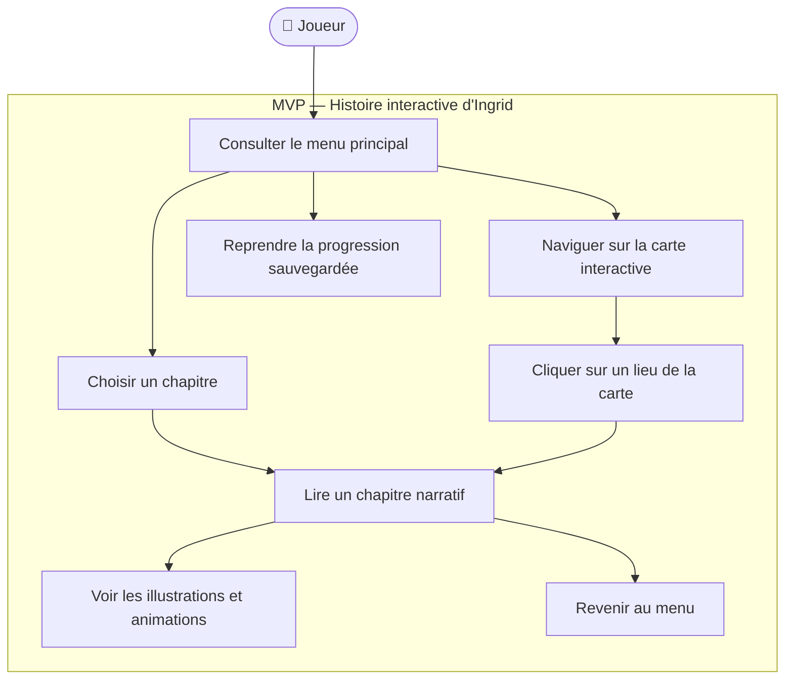
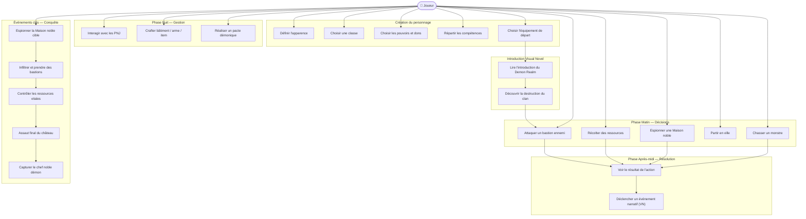
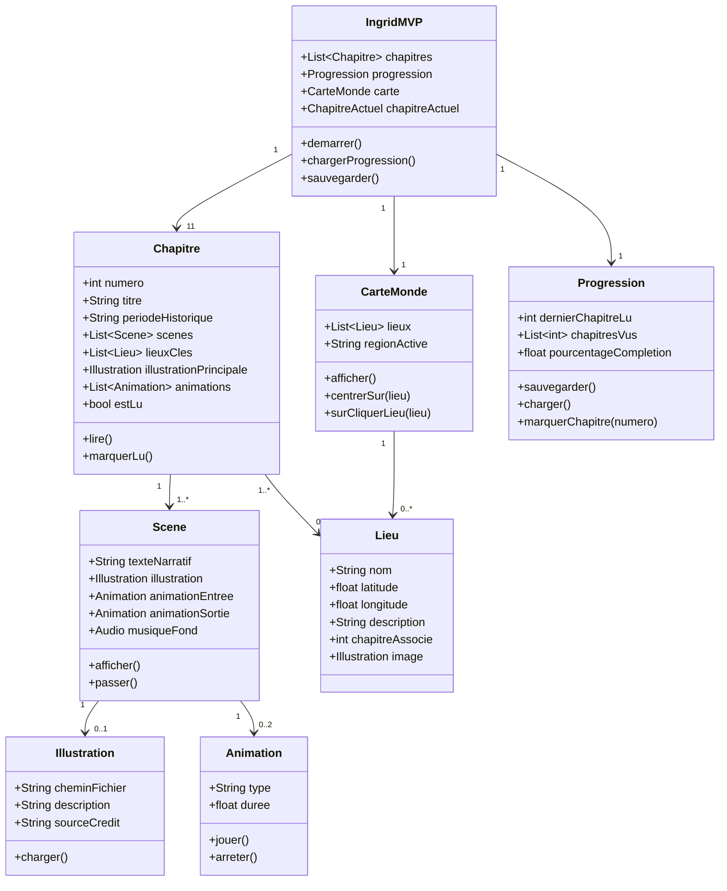
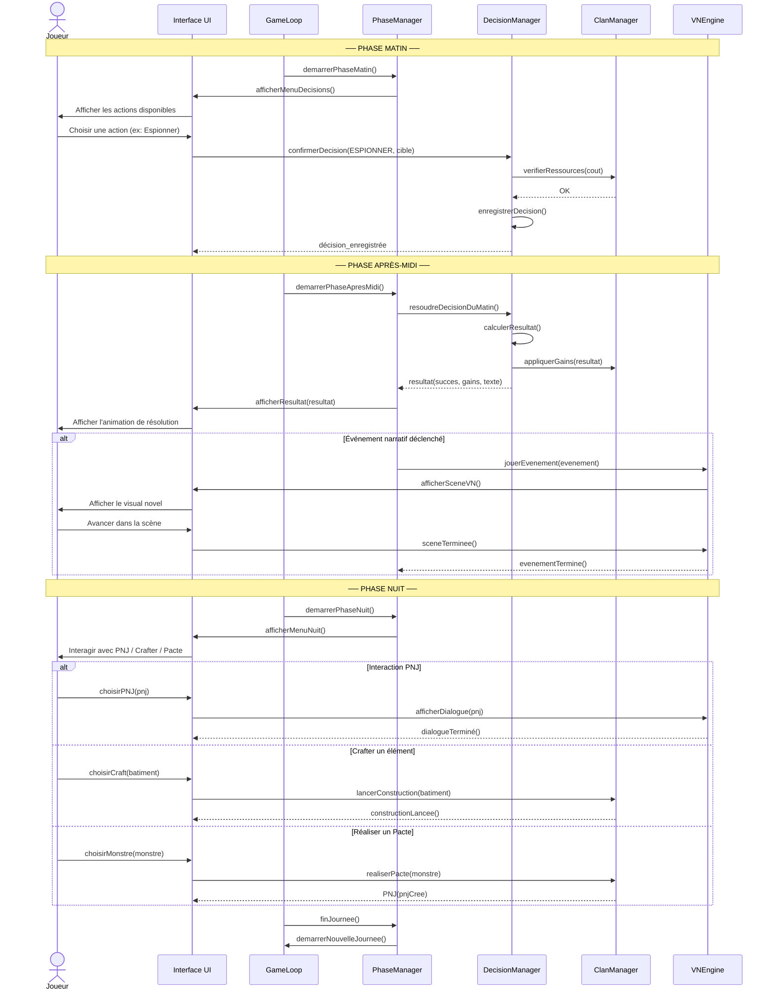
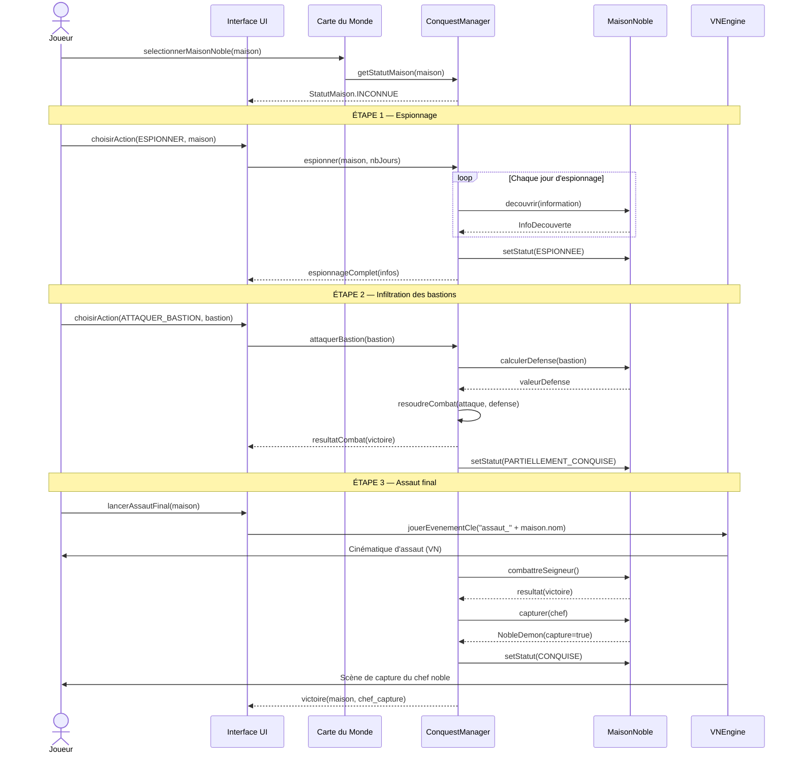
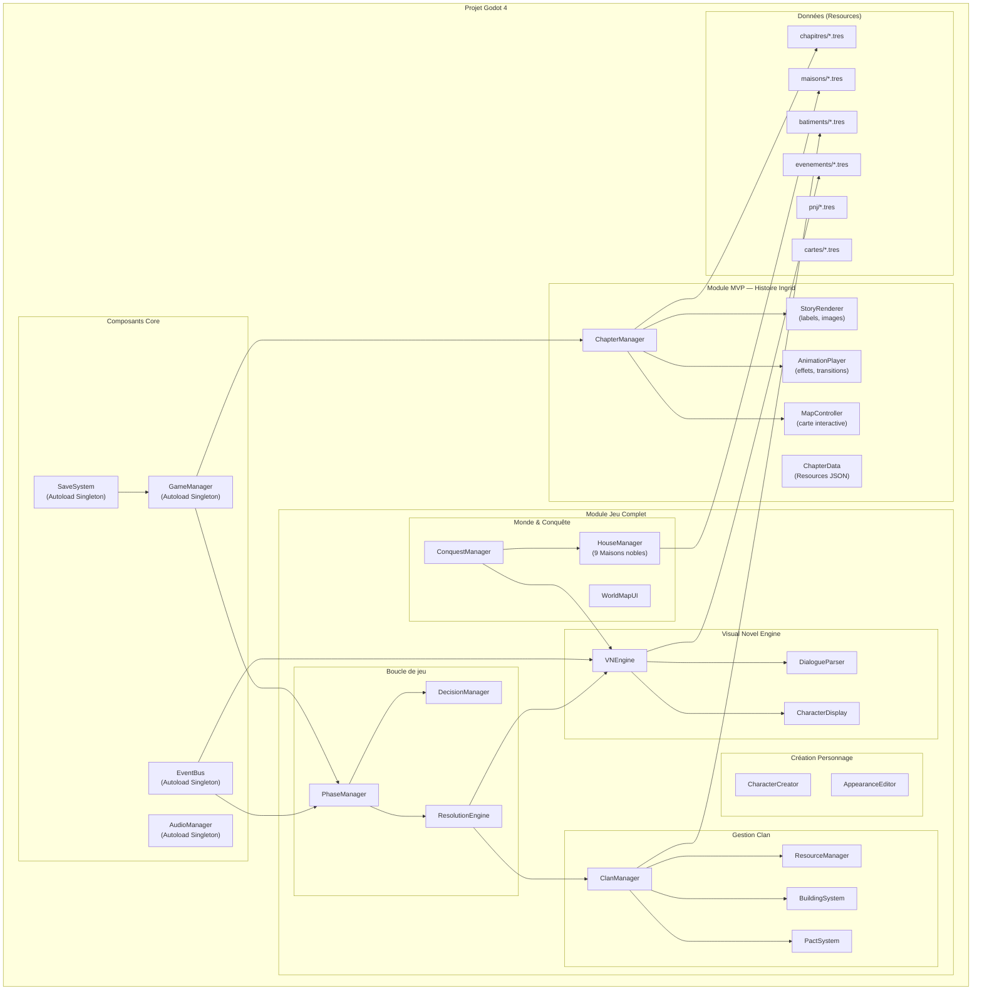

# Diagrammes UML — Royaumes Démoniques

> Tous les diagrammes sont écrits en **Mermaid** (rendu dans VS Code avec l'extension *Markdown Preview Mermaid Support*, ou sur GitHub).

---

## Sommaire

1. [Diagramme de cas d'utilisation — MVP](#1-diagramme-de-cas-dutilisation--mvp)
2. [Diagramme de cas d'utilisation — Jeu complet](#2-diagramme-de-cas-dutilisation--jeu-complet)
3. [Diagramme de classes — Domaine métier RPG](#3-diagramme-de-classes--domaine-métier-rpg)
4. [Diagramme de classes — MVP (Histoire Ingrid)](#4-diagramme-de-classes--mvp-histoire-ingrid)
5. [Diagramme de séquence — Cycle journalier](#5-diagramme-de-séquence--cycle-journalier)
6. [Diagramme de séquence — Conquête d'une Maison noble](#6-diagramme-de-séquence--conquête-dune-maison-noble)
7. [Diagramme de composants — Architecture Godot 4](#7-diagramme-de-composants--architecture-godot-4)

---

## 1. Diagramme de cas d'utilisation — MVP

---

## 2. Diagramme de cas d'utilisation — Jeu complet

---

## 3. Diagramme de classes — Domaine métier RPG

```mermaid
classDiagram
    class Joueur {
        +String nom
        +Apparence apparence
        +ClassePersonnage classe
        +Stats stats
        +List~Pouvoir~ pouvoirs
        +List~Don~ dons
        +List~Competence~ competences
        +List~Item~ equipement
        +evoluer()
        +obtenirStats() Stats
    }

    class Stats {
        +int force
        +int magie
        +int espionnage
        +int artisanat
        +int diplomatie
        +int commandement
        +int pointsDeVie
        +int pointsDeMagie
        +calculerTotal() int
    }

    class ClassePersonnage {
        <<enumeration>>
        CHEVALIER_SOMBRE
        MAGE_DU_PACTE
        STRATEGE_DES_OMBRES
        FORGERON_DE_SANG
        SANG_NOBLE
    }

    class Pouvoir {
        +String nom
        +String description
        +int coutMagie
        +String element
        +utiliser(cible)
    }

    class Don {
        +String nom
        +String description
        +String effetPassif
        +appliquer()
    }

    class Clan {
        +String nom
        +Blason blason
        +Ressources ressources
        +List~Batiment~ batiments
        +List~PNJ~ membres
        +Territoire territoire
        +int niveauReputation
        +construire(batiment)
        +recruter(pnj)
        +calculerRevenues() Ressources
    }

    class Blason {
        +String nomFamille
        +String couleur
        +String embleme
        +bool estRestauré
        +restaurer()
    }

    class Ressources {
        +int or
        +int energieMystique
        +int soldats
        +int influence
        +ajouter(type, quantité)
        +depenser(type, quantité) bool
    }

    class Batiment {
        +String nom
        +String description
        +int coutConstruction
        +Map~String_int~ production
        +bool estConstruit
        +construire()
        +getProduction() Map
    }

    class JourneeDeJeu {
        +int numero
        +PhaseJeu phaseActuelle
        +List~Decision~ decisionsDisponibles
        +EvenementNarratif evenement
        +changerPhase(phase)
        +resoudreDecision(decision) Resultat
    }

    class PhaseJeu {
        <<enumeration>>
        MATIN
        APRES_MIDI
        NUIT
    }

    class Decision {
        +TypeDecision type
        +String description
        +Cible cible
        +Ressources cout
        +Resultat resoudre()
    }

    class TypeDecision {
        <<enumeration>>
        ATTAQUER
        RECOLTER
        ESPIONNER
        ALLER_EN_VILLE
        CHASSER
        EVENEMENT_LIBRE
    }

    class Resultat {
        +bool succes
        +Ressources gains
        +Ressources pertes
        +String texteNarratif
        +EvenementNarratif evenementDeclenche
    }

    class PNJ {
        +String nom
        +TypePNJ type
        +int niveauAffinite
        +Monster origineMonster
        +List~Dialogue~ dialogues
        +interagir() Dialogue
        +evoluerAffinite(valeur)
    }

    class TypePNJ {
        <<enumeration>>
        COMBATTANT
        ARTISAN
        ESPION
        DIPLOMATE
        MENTOR
    }

    class MaisonNoble {
        +String nom
        +NobleDemon chef
        +Territoire territoire
        +List~Bastion~ bastions
        +Ressources ressourcesVitales
        +StatutMaison statut
        +int niveauEspionnage
        +calculerDefense() int
    }

    class StatutMaison {
        <<enumeration>>
        INCONNUE
        ESPIONNEE
        INFILTREE
        PARTIELLEMENT_CONQUISE
        CONQUISE
    }

    class NobleDemon {
        +String nom
        +MaisonNoble maison
        +int puissance
        +bool estCapture
        +Stats stats
        +combattre(adversaire) Resultat
        +seRendre() bool
    }

    class EvenementNarratif {
        +String titre
        +List~SceneVN~ scenes
        +TypeEvenement type
        +jouер()
    }

    class Pacte {
        +Monster monstre
        +PNJ pnjResultant
        +int coutEnergie
        +bool realiser() PNJ
    }

    Joueur "1" --> "1" Stats
    Joueur "1" --> "1" ClassePersonnage
    Joueur "1" --> "0..*" Pouvoir
    Joueur "1" --> "0..*" Don
    Joueur "1" --> "1" Clan

    Clan "1" --> "1" Blason
    Clan "1" --> "1" Ressources
    Clan "1" --> "0..*" Batiment
    Clan "1" --> "0..*" PNJ

    JourneeDeJeu "1" --> "1" PhaseJeu
    JourneeDeJeu "1" --> "1..*" Decision
    Decision "1" --> "1" TypeDecision
    Decision "1" --> "1" Resultat
    Resultat "0..1" --> "1" EvenementNarratif

    PNJ "1" --> "1" TypePNJ
    Pacte "1" --> "1" PNJ

    MaisonNoble "1" --> "1" NobleDemon
    MaisonNoble "1" --> "1" StatutMaison
```

---

## 4. Diagramme de classes — MVP (Histoire Ingrid)

---

## 5. Diagramme de séquence — Cycle journalier

---

## 6. Diagramme de séquence — Conquête d'une Maison noble

---

## 7. Diagramme de composants — Architecture Godot 4

