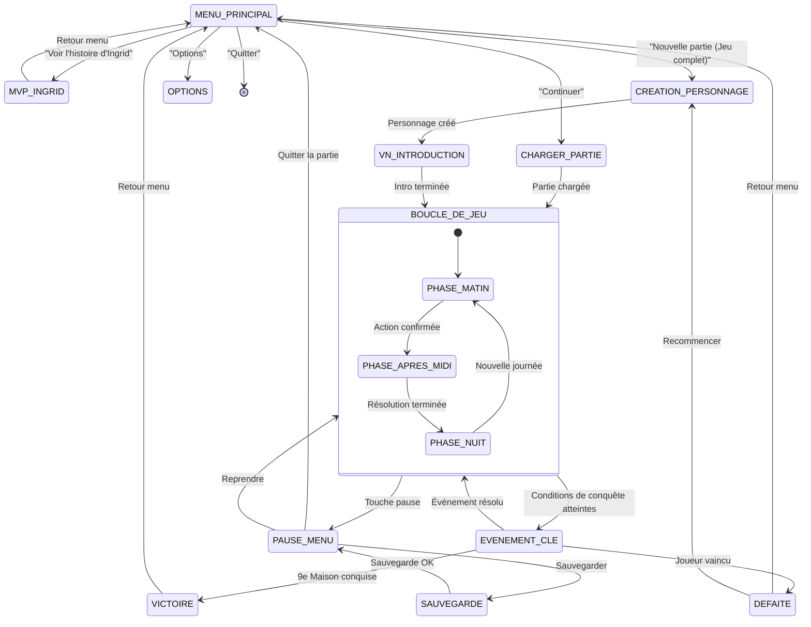
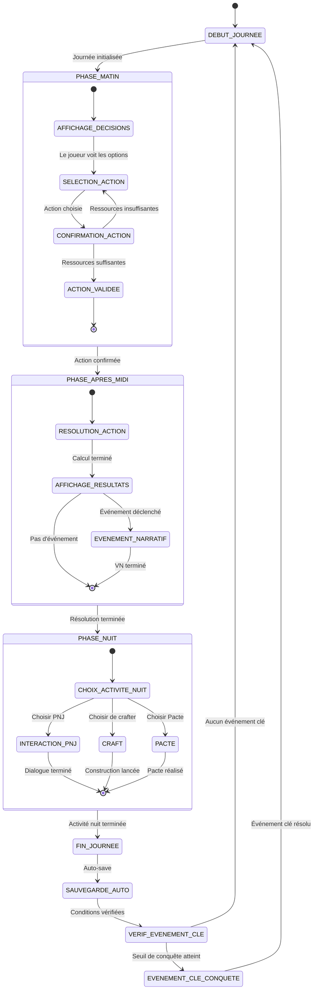
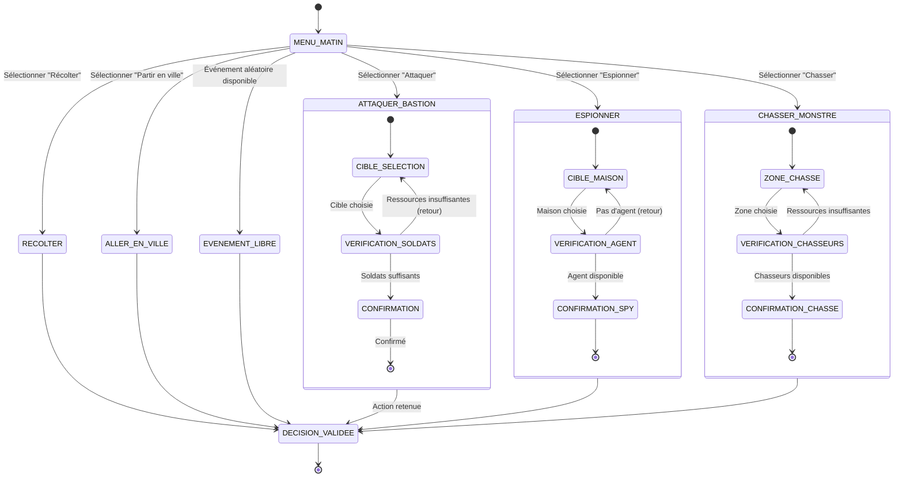
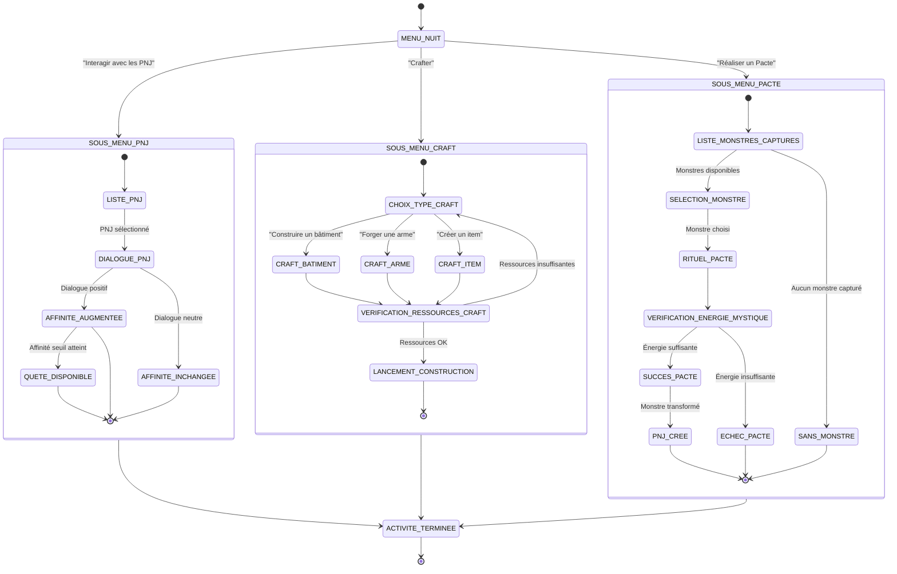
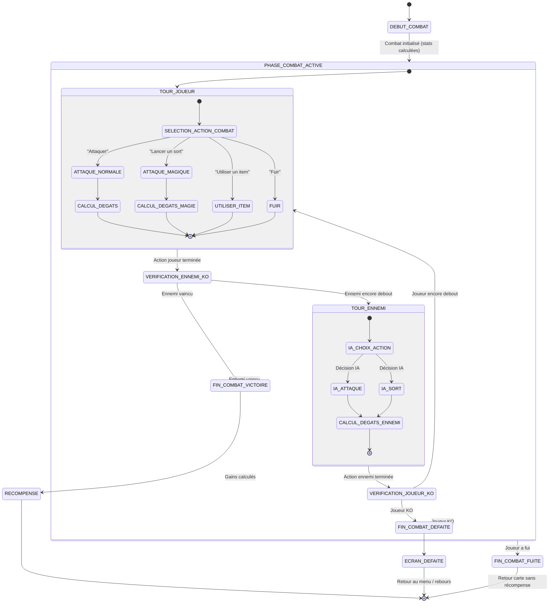
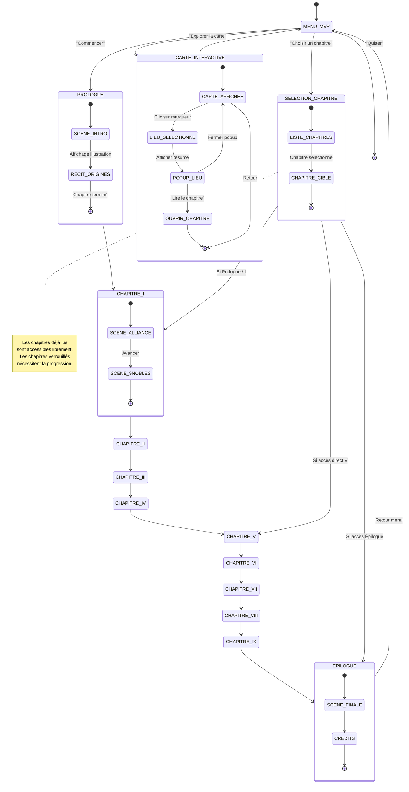

# Machines à états — Royaumes Démoniques

> Diagrammes écrits en **Mermaid** (stateDiagram-v2).

---

## Sommaire

1. [Machine à états principale — Le jeu global](#1-machine-à-états-principale--le-jeu-global)
2. [Machine à états — Cycle journalier](#2-machine-à-états--cycle-journalier)
3. [Machine à états — Phase Matin (décisions)](#3-machine-à-états--phase-matin-décisions)
4. [Machine à états — Phase Nuit (gestion)](#4-machine-à-états--phase-nuit-gestion)
5. [Machine à états — Conquête d'une Maison noble](#5-machine-à-états--conquête-dune-maison-noble)
6. [Machine à états — Combat](#6-machine-à-états--combat)
7. [Machine à états — MVP (parcours d'Ingrid)](#7-machine-à-états--mvp-parcours-dingrid)

---

## 1. Machine à états principale — Le jeu global

---

## 2. Machine à états — Cycle journalier

---

## 3. Machine à états — Phase Matin (décisions)

---

## 4. Machine à états — Phase Nuit (gestion)

---

## 5. Machine à états — Conquête d'une Maison noble

```mermaid
stateDiagram
    [*] --> MAISON_INCONNUE

    MAISON_INCONNUE --> MAISON_ESPIONNEE : Espionnage réussi (seuil d'info atteint)

    state MAISON_ESPIONNEE {
        [*] --> INFO_BASIQUE
        INFO_BASIQUE --> INFO_AVANCEE : Espionnage prolongé
        INFO_AVANCEE --> INFO_COMPLETE : Toutes ressources vitales identifiées
        INFO_COMPLETE --> [*]
    }

    MAISON_ESPIONNEE --> PHASE_INFILTRATION : Décision d'attaque prise

    state PHASE_INFILTRATION {
        [*] --> BASTION_1_INTACT
        BASTION_1_INTACT --> BASTION_1_CONQUIS : Attaque victorieuse
        BASTION_1_CONQUIS --> BASTION_2_INTACT
        BASTION_2_INTACT --> BASTION_2_CONQUIS : Attaque victorieuse
        BASTION_2_CONQUIS --> BASTION_3_INTACT
        BASTION_3_INTACT --> BASTION_3_CONQUIS : Attaque victorieuse
        BASTION_3_CONQUIS --> [*]

        BASTION_1_INTACT --> DEFAITE_PARTIELLE : Attaque échouée
        BASTION_2_INTACT --> DEFAITE_PARTIELLE
        BASTION_3_INTACT --> DEFAITE_PARTIELLE
        DEFAITE_PARTIELLE --> BASTION_1_INTACT : Reprendre plus tard
    }

    PHASE_INFILTRATION --> CONTROLE_RESSOURCES : Tous bastions pris

    state CONTROLE_RESSOURCES {
        [*] --> RESSOURCES_CONTESTEES
        RESSOURCES_CONTESTEES --> RESSOURCES_CONTROLEES : Occupation réussie
    }

    CONTROLE_RESSOURCES --> ASSAUT_FINAL : Ressources sécurisées

    state ASSAUT_FINAL {
        [*] --> CINEMATIQUE_ASSAUT
        CINEMATIQUE_ASSAUT --> COMBAT_BOSS : VN d'intro terminé
        COMBAT_BOSS --> VICTOIRE_ASSAUT : Joueur victorieux
        COMBAT_BOSS --> DEFAITE_ASSAUT : Joueur vaincu
        DEFAITE_ASSAUT --> [*] : Retour phase normale (perte de ressources)
        VICTOIRE_ASSAUT --> CAPTURE_CHEF
        CAPTURE_CHEF --> CHOIX_DESTIN_CHEF
        CHOIX_DESTIN_CHEF --> CHEF_RECRUTE : Recrutement
        CHOIX_DESTIN_CHEF --> CHEF_ECHANGE : Diplomatie
        CHOIX_DESTIN_CHEF --> CHEF_VAINCU : Élimination
    }

    ASSAUT_FINAL --> MAISON_CONQUISE : Assaut final réussi

    state MAISON_CONQUISE {
        [*] --> TERRITOIRE_INTEGRE
        TERRITOIRE_INTEGRE --> RESSOURCES_INTEGREES : Intégration clan
    }

    MAISON_CONQUISE --> [*]
```

---

## 6. Machine à états — Combat

---

## 7. Machine à états — MVP (parcours d'Ingrid)

---

## Tableau de synthèse des états

| Machine à états | Nb d'états | Complexité | Module |
|---|---|---|---|
| Jeu global | 12 | ★★★☆☆ | Core |
| Cycle journalier | 14 | ★★★☆☆ | GameLoop |
| Phase Matin | 10 | ★★☆☆☆ | DecisionManager |
| Phase Nuit | 15 | ★★★☆☆ | NightManager |
| Conquête Maison noble | 18 | ★★★★☆ | ConquestManager |
| Combat | 16 | ★★★☆☆ | CombatEngine |
| MVP Ingrid | 20+ | ★★☆☆☆ | ChapterManager |
