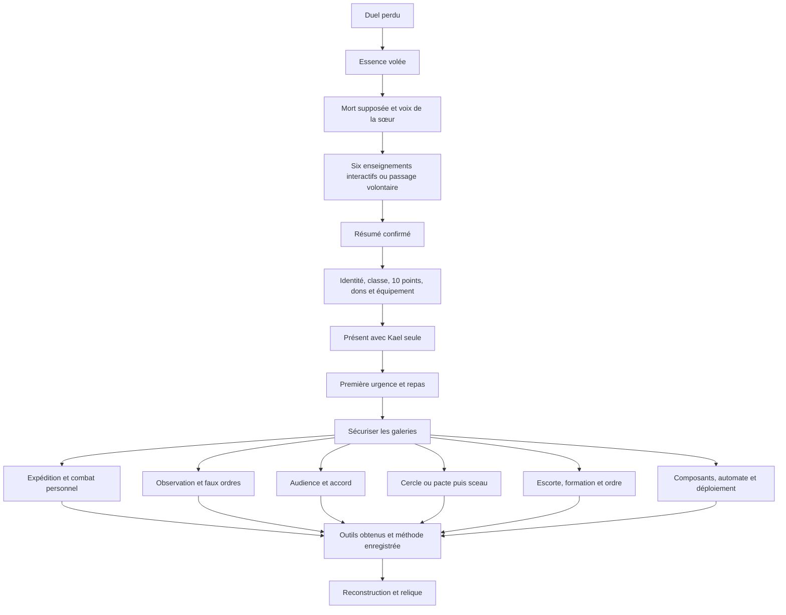

# Flux, automates et reprise

## Automates utilisés

`StateMachine` est un `RefCounted` avec un graphe explicite d’événements autorisés. Il refuse les transitions inconnues, le redémarrage et la réentrance pendant `enter/exit`. `restore` change l’état sans rejouer les effets d’entrée. Les états conservent une référence faible vers leur automate.

`GameLoopStateMachine`, appelé par `ClanManager.advance_day_phase`, pilote :

| Transition | Effet |
| --- | --- |
| matin → après-midi | Résoudre les affectations de la journée |
| après-midi → nuit | Ouvrir l’action de nuit et appliquer les passifs nocturnes |
| nuit → matin | Production, événements autorisés, repos du refuge et nouvelle journée |

La journée n’avance pas pendant une expédition active. `daily_phase` et `day_report` sont sauvegardés dans le fichier du clan. Les anciennes sauvegardes sans phase reprennent au matin ou le soir d’après `moment_journee`.

`ExpeditionStateMachine` pilote `arrival → exploration → combat → exploration`, puis `return → returned`. La victoire autorise la suite, la défaite impose le retour. Le repli est possible depuis l’arrivée, l’exploration ou le combat. L’entrée exige `run.inspected.passage`. Les salles ne sont ni fouillées ni combattues pendant l’arrivée. Le butin et l’expérience sont déposés une seule fois au retour.

## Une sauvegarde métier

- `progress.json` du slot : `opening.version`, `run_id`, `stage`, `active`, `finished`, `index`, `choices`, `draft_ready`, `memories`. Les souvenirs conservent la séquence, l’étape, le feedback à confirmer, les leçons terminées/passées, les affinités, les événements et la simulation avec son état de tirage. L’ouverture est reprenable même sans personnage créé.
- Brouillon de création dans le répertoire du slot, enregistré lors des soumissions et changements d’étape.
- Fichier du clan : `campaign`, `daily_phase`, `day_report`, `corruption_state`, ressources, PNJ et fiche canoniques.
- `campaign.run` : état d’arrivée/exploration, inspections, expositions déjà appliquées, salles, bataille, équipe, blessures et sacs.

`GameManager.resume_campaign` choisit prologue, souvenirs, création, sortie active ou hub. Après la création, `campaign.memories` détient le bilan des leçons et `opening.memories` est retiré. `campaign.opening_run_id` permet de reprendre une coupure entre la sauvegarde du clan et la fermeture de l’ouverture. Les ouvertures antérieures sans version continuent avec leurs tableaux historiques. Une transition de scène en cours ne peut pas être lancée une deuxième fois. Les sorties anciennes sans `run.state` reprennent leur salle et leur combat existants, sans nouvelle arrivée imposée. Une sauvegarde sans corruption initialise les profils à partir des valeurs éventuelles du registre PNJ, sinon à zéro.

Voir [CORRUPTION.md](CORRUPTION.md) pour l’exposition et les effets en combat.

## Objectifs et voies

`campaign.power_routes` porte les objectifs, leurs résolutions complètes, les connaissances découvertes, les préparatifs, les artefacts, la formation, le moral, la fatigue, la relation locale avec les gardiens, l’exposition, l’historique et les événements futurs. Le résultat en attente reste sauvegardé jusqu’à sa confirmation.

Les réserves restent dans `ClanManager.ressources`, les soldats dans le pool canonique, la corruption dans `CorruptionService` et les pactes dans `PactService`. Un identifiant de pacte relie le préparatif à son propriétaire. Aucun service des voies ne conserve une copie mutable du monde : il retourne un résultat que l’orchestrateur applique.

`NarrativeObjectiveService.register` accepte d’autres objectifs ; `resolve` exige une méthode autorisée et refuse la seconde résolution. `ending_ready` vérifie tous les `ending_objectives` configurés, quelle que soit leur méthode. La verticale ne configure pas les galeries comme fin de la campagne entière.
