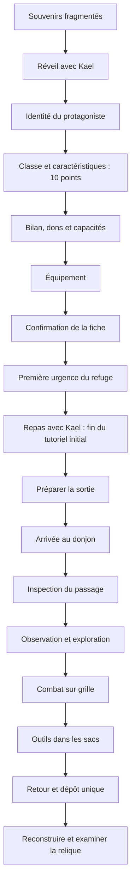

# Flux, automates et reprise

## Automates utilisés

`StateMachine` est un `RefCounted` avec un graphe explicite d’événements autorisés. Il refuse les transitions inconnues, le redémarrage et la réentrance pendant `enter/exit`. `restore` change l’état sans rejouer les effets d’entrée. Les états conservent une référence faible vers leur automate.

`GameLoopStateMachine`, appelé par `ClanManager.advance_day_phase`, pilote :

| Transition | Effet |
| --- | --- |
| matin → après-midi | Résoudre les affectations de la journée |
| après-midi → nuit | Ouvrir l’action de nuit et appliquer les passifs nocturnes |
| nuit → matin | Production, événements autorisés, repos du refuge et nouvelle journée |

La journée n’avance pas pendant une expédition active. `daily_phase` et `day_report` sont sauvegardés dans le fichier du clan. Les anciennes sauvegardes sans phase reprennent au matin ou le soir d’après `moment_journee`.

`ExpeditionStateMachine` pilote `arrival → exploration → combat → exploration`, puis `return → returned`. La victoire autorise la suite, la défaite impose le retour. Le repli est possible depuis l’arrivée, l’exploration ou le combat. L’entrée exige `run.inspected.passage`. Les salles ne sont ni fouillées ni combattues pendant l’arrivée. Le butin et l’expérience sont déposés une seule fois au retour.

## Une sauvegarde métier

- `progress.json` du slot : `opening.active`, `finished`, `index`, `choices`, `draft_ready`. L’ouverture est reprenable même sans personnage créé.
- Brouillon de création dans le répertoire du slot, enregistré lors des soumissions et changements d’étape.
- Fichier du clan : `campaign`, `daily_phase`, `day_report`, `corruption_state`, ressources, PNJ et fiche canoniques.
- `campaign.run` : état d’arrivée/exploration, inspections, expositions déjà appliquées, salles, bataille, équipe, blessures et sacs.

`GameManager.resume_campaign` choisit ouverture, création, sortie active ou hub. Une transition de scène en cours ne peut pas être lancée une deuxième fois. Les sorties anciennes sans `run.state` reprennent leur salle et leur combat existants, sans nouvelle arrivée imposée. Une sauvegarde sans corruption initialise les profils à partir des valeurs éventuelles du registre PNJ, sinon à zéro.

Voir [CORRUPTION.md](CORRUPTION.md) pour l’exposition et les effets en combat.
